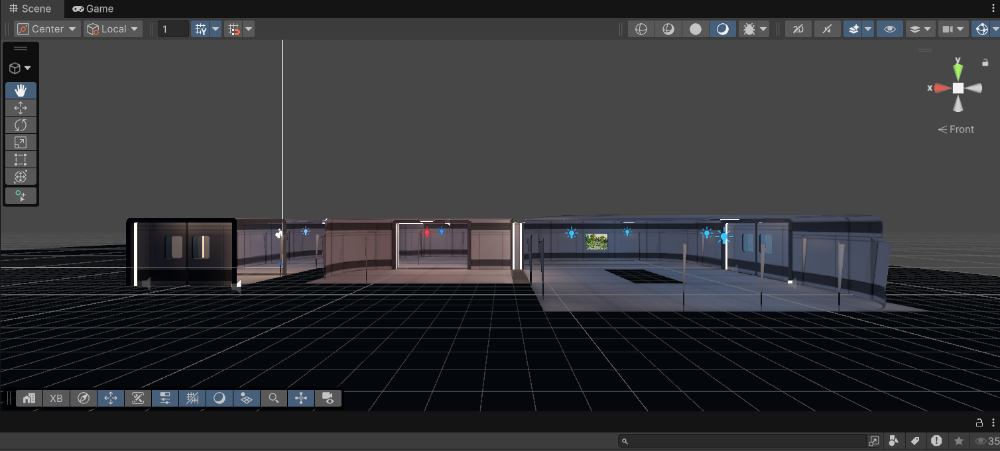
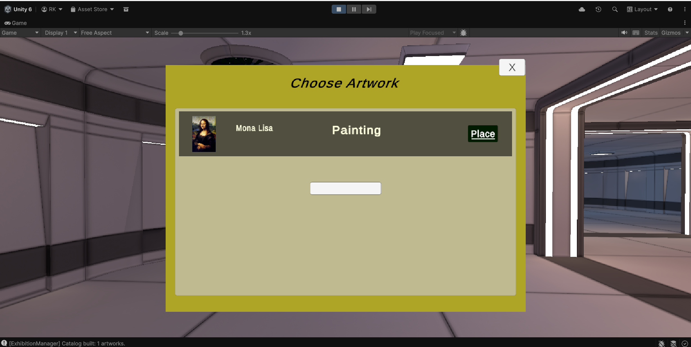
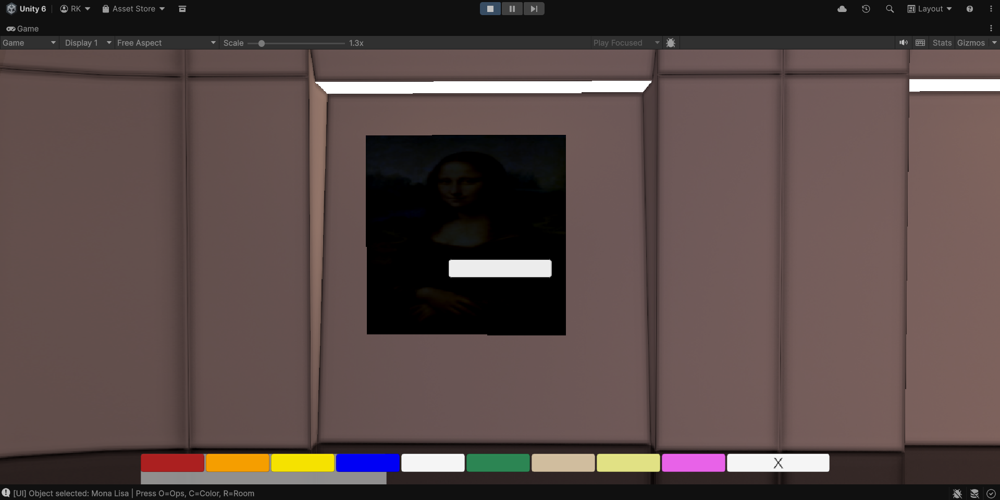
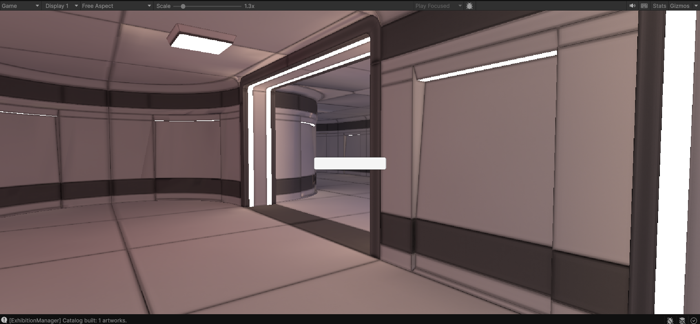

# 🎨 Virtual Exhibition Center Space

A 3D interactive virtual art exhibition built using **Unity, Blender, and C#**.  
This project allows users to explore a virtual gallery, place artworks, and customize the environment in real time.

---

## 📌 Project Overview

The **Virtual Exhibition Center Space** is designed to provide an immersive way to experience digital art.  
Instead of a static gallery, users can actively interact with the environment.

Users can
- Walk through a 3D exhibition hall (360° view)
- View and select artworks from a dashboard
- Place artworks in the scene using drag-and-drop
- Resize, rotate, flip, and delete objects
- Change object colors using a color palette
- Customize the background of the exhibition hall

---

## 🎯 Objective

The main goal of this project is to
- Make art exhibitions more interactive and accessible
- Remove physical limitations of traditional galleries
- Provide a flexible and engaging digital art experience

---

## 🛠️ Tools & Technologies

- **Unity** – Game engine for building the 3D environment  
- **Blender** – Used for creating 3D models and assets  
- **C#** – Used for scripting interactions and game logic  

---

## 🎮 Features

- 3D immersive exhibition hall
- Smooth 360-degree navigation
- Dashboard-based artwork selection
- Drag-and-drop object placement
- Real-time object transformation such as resize, rotate, and flip
- Color customization for objects and background
- Object deletion and scene management

---

## 🧠 How It Works

1. 3D environment is designed in Blender  
2. Models are imported into Unity  
3. C# scripts handle movement and interactions  
4. UI dashboard is used to select and place artworks  
5. Users customize and interact with objects in real time  

---

## 🎨 Virtual Exhibition Preview

### Outer Layout

### Dashboard Interface

### Color Customization

### Indoor View

## 🚀 Future Improvements

- Multiplayer support for collaborative exhibitions  
- VR integration  
- AI-based artwork recommendations  
- Real-time chat and user interaction  
- More advanced lighting and environment effects  

---

## 👨‍💻 Team Members

- **[Rachita Laad](https://github.com/rachitalaad)** – B.Tech CSE, IIIT Vadodara  
- **[Rasika Kale](https://github.com/rasika2114)** – B.Tech CSE, IIIT Vadodara  
- **[Ayush Ranjan](https://github.com/AyushRanjan13)** – B.Tech CSE, IIIT Vadodara  

---
